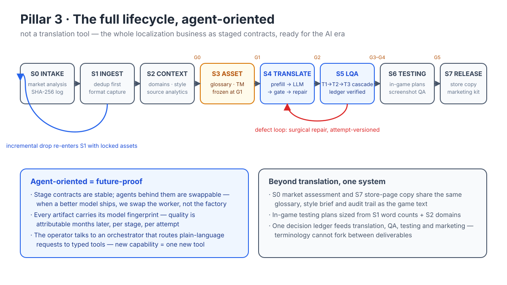
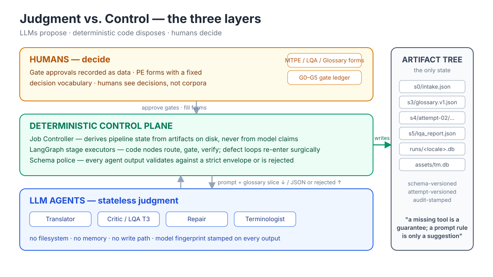
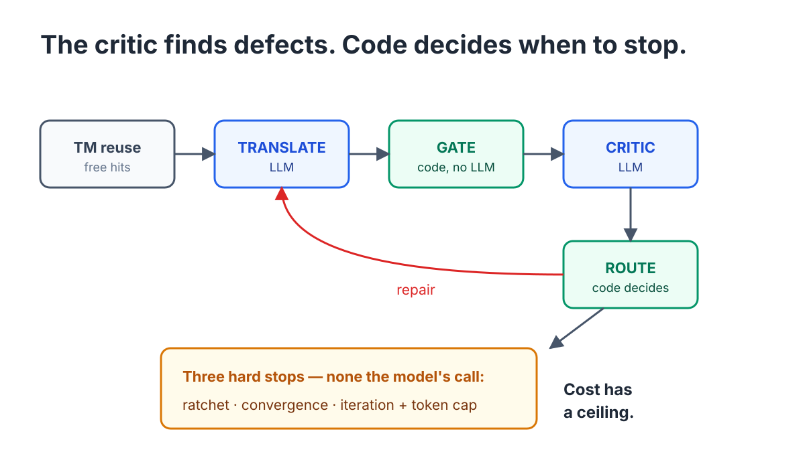
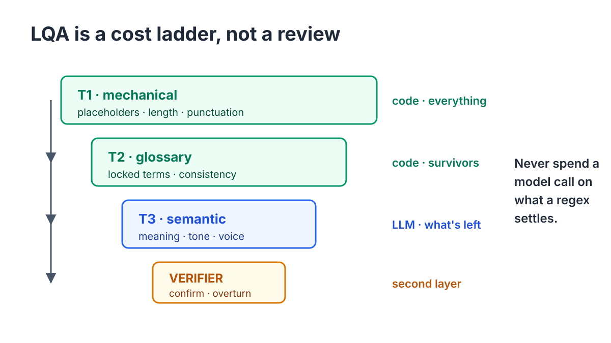
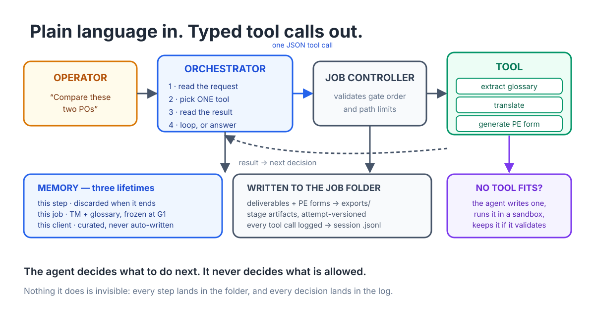
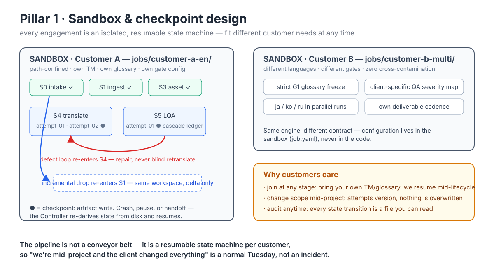
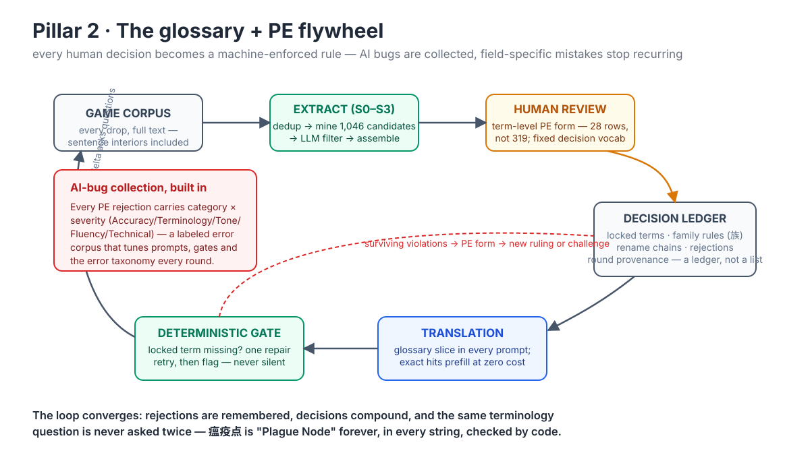

# Orbit8-Agent

Localization agent system: **LangGraph stage executors under a deterministic
Job Controller** — 8 stages, 6 human gates, artifacts authoritative.

Implements [localization-agent-langgraph-design.md](localization-agent-langgraph-design.md),
mapped onto Localization Pipeline V2
(`../localization-pipeline/docs/LIFECYCLE.md`). Prompts and step contracts
are ported from `../localization-pipeline` (`locpipe/agents.py`,
`docs/agents/*.md` — those skill documents remain the source of truth).

## The lifecycle

Eight stages, six human gates. The defect loop is surgical and
attempt-versioned; an incremental drop re-enters at S1 against locked
assets.



## Architecture

Three layers, split by what each is actually good at: humans decide, code
controls, models judge — and the artifact tree is the only shared state.



```
┌──────────────────────────────────────────────────────────────┐
│ Job Controller (controller.py, plain Python)                 │
│   scans jobs/<id>/ artifact tree → derives stage → checks    │
│   gate → invokes exactly ONE stage executor per `next` call  │
│   ── the thing that guarantees agents never control the loop │
├──────────────────────────────────────────────────────────────┤
│ Stage executors (graphs/)                                    │
│   g_context   S2  LangGraph, 2 agents map-parallel           │
│   g_translate S4  LangGraph — THE control loop:              │
│                   prefill→tm_reuse→translate→gate→critic     │
│                   →route(ratchet/convergence/budget)→repair  │
│   g_lqa       S5  LangGraph tier cascade T1→T2→T3→verify     │
│   ingest      S1  plain function (100% deterministic —       │
│                   deliberately NOT a graph, design §2)       │
│   intake/asset/testing/release: plain single-agent pipelines │
├──────────────────────────────────────────────────────────────┤
│ Agents (agents.py) — stateless prompt functions returning    │
│   (typed object, model_fingerprint); never write artifacts   │
├──────────────────────────────────────────────────────────────┤
│ Memory (memory.py) — three lifetimes:                        │
│   graph state (discarded) · job assets (RunDB, TM, frozen    │
│   T1 glossary) · tenant/genre memory (curated, inbox-only)   │
└──────────────────────────────────────────────────────────────┘
```

Key invariants (enforced in code, not prompts — design §7):

- **Artifacts are authoritative.** No status field can disagree with the
  tree; deleting an artifact rewinds the job. LangGraph checkpoints are
  crash recovery within one stage-run, discarded after the artifact write.
- **Every gate falls between graphs.** Gate holds live in controller state
  (`job.json` in v0; the design's Postgres row in deployment), cleared only
  by a human `approve`.
- **S4/S5 artifacts are attempt-versioned** (`s4/attempt-01/…`) so defect
  loops never overwrite what a client bug report points at.
- **The Critic never terminates its own loop** — `route` reads the ratchet
  (severity-weighted badness, strictly-better-or-rollback), the convergence
  rule (only NEW findings justify another repair), `max_iterations`, and a
  per-batch token budget.
- **After G1 the glossary is frozen.** This package has no write path to a
  locked glossary; changes travel through an `AuditedFixRequest` artifact.
- **The domain classifier fails expensive**: low-confidence labels route TO
  the MTPE queue, never away from it. MTPE items are tagged
  `domain_policy` / `failure` / `low_confidence` distinctly.
- **Model fingerprints** (model id + prompt hash) ride every agent-produced
  envelope for six-weeks-later attribution and benchmark reproducibility.

### Stage 4 — the critic finds defects, code decides when to stop

`route` is a deterministic conditional edge. The three hard stops — the
ratchet, the convergence rule, and the token budget — are all read in
code, because the moment an agent can decide "good enough", cost has no
ceiling.



### Stage 5 — LQA as a cost ladder

Tiers run in sequence, cheapest first: T1 mechanical on everything, T2
project-level consistency on what survives, T3 LLM semantic only on the
remainder, then a second-layer verifier over T3's findings. Precision
beats recall by a wide margin — studios abandon tooling that cries wolf.



## Interface layer: chat orchestrator

`orbit8 chat` puts a natural-language operator interface OVER the
controller (`orchestrator.py`). The LLM interprets your text and decides
which controller tools to call (`status`, `next_step`, `approve`,
`read_artifact`, `flagged`); execution stays deterministic underneath. It
physically cannot skip stages or write artifacts — those tools don't
exist — and `approve` always records the human operator named at chat
start, with gate order still validated by the controller.

```bash
uv run orbit8 chat jobs demo-ko --by operator
you> 现在到哪一步了？
you> 推进到下一个 gate，然后把 flagged 的字符串给我看看
you> 没问题，通过 G2
```

Plain language in, typed tool calls out — and when no tool fits, that is
a visible gap rather than an improvised action.



## Sandbox: agent-generated ingest adapters

Unknown source formats no longer hard-fail. The **Adapter-Writer** agent
sees a 4KB sample plus the output contract, writes a stdlib-only converter,
and the controller runs it in a sandbox (`sandbox.py`) with a
validate-retry loop (≤3 attempts, errors fed back). Two walls:
**containment** — separate `python -I -S` process, scratch dir with a copy
of the input, empty env, hard timeout, POSIX rlimits (CPU/mem/fsize/nproc);
**distrust** — side effects are discarded, only stdout crosses back, and it
must validate as unique-key `{key, text}` records (`codegen.py`). The
generated script is stored as an s1 artifact with a model fingerprint and
re-runs deterministically on later ingests (INCREMENTAL path) — generated
once, audited, then frozen in behavior. Adversarial-grade isolation should
add a container (`docker run --network none --read-only`) around the same
entry point.

Each job is its own sandbox on disk too: one customer's assets, TM and
decision ledger cannot reach another's.



## Glossary + post-editing flywheel

Terminology is the one asset that compounds. A human decision enters the
ledger once, and from then on the deterministic gate enforces it on every
string — which is also how AI-introduced bugs get collected rather than
argued about.



## Skill docs — playbooks loaded at runtime

Policies that shape agent behavior live under
[`docs/skills/`](docs/skills/README.md). One playbook per lifecycle phase,
selected by what the **Controller derives** — routing is a lookup on
`(phase, gate)`, never an inference from the operator's phrasing, so an
agent cannot talk its way into another stage's guidance.

Each doc declares the tools it uses in frontmatter, and the loader
validates every name against the orchestrator's live registry. A doc naming
a tool that does not exist **fails to load** rather than degrading: design
§7 again — a playbook may select and sequence existing tools, never invent
capability.

```
docs/skills/
  README.md              router: (phase, gate) → playbook
  lifecycle/             intake · ingest · context · asset · pilot
                         production · lqa · flagged · testing · release
  operations/            po-roundtrip · glossary-update
  lqa-batch-split.md     policy spec (story n=5, strings n=20)
```

`lqa-batch-split.md` is a spec the code implements rather than a playbook,
and a test pins `LQAConfig` to the numbers it states — which is how a
silent drift got caught: the doc said Tier-3 string batches of 20 while the
main pipeline ran 10.

## Starting a new project

### What you need first

**The game's source strings.** The pipeline translates existing text; it
does not author it. S1 ingests two formats natively:

- **flat JSON** — `{key: source text}`, not nested:
  `{"UI_START": "开始游戏", "ITEM_AXE": "石斧：采集效率+15%"}`
- **`.po`** — gettext/Unreal export, `msgctxt` as key, `msgid` as source

Anything else (xlsx, csv, a custom format) goes through the Adapter-Writer:
the agent sees a 4KB sample, writes a converter, and it runs sandboxed —
see [Sandbox](#sandbox-agent-generated-ingest-adapters).

Nothing else needs to exist. `job init` creates the whole job tree.

### The three ways in

```bash
# 1. Conversational — describe it, confirm, done
uv run orbit8 new /path/to/example-project
```

Finds the source under `10-received/` itself, asks you to describe the
project, and shows the proposed intake for confirmation **before writing
anything**:

```
Source files under /path/to/example-project:
  1. Strings.json (412 strings)  in 10-received/20260828-drop
Use this source? [Y/n]

  job id        examplegame-en-ja
  game          ExampleGame
  source lang   zh-CN
  targets       en, ja
  genre         survival
  engine        unknown
  client lang   (none)
  platforms     (none)
  sources       10-received/20260828-drop/Strings.json
  warning no client_lang — bug reports default to the target language,
          which the client may not read

Create this job? [y/N/edit]
```

Every field is shown including the empty ones — an omission is a decision
too, and the failure mode is confirming a form whose blank `client_lang`
you never noticed. `edit` re-proposes from a correction in words
("targets should also include Korean").

The model **proposes**; a deterministic check **validates**; you **commit**.
The intake form is the job's constitution — `source_lang` and
`target_locales` decide what every later stage does — so the model's role
stops at proposing. Validation catches what a model gets confidently wrong:
`jp` for `ja`, a source language listed as its own target, an unsafe
`job_id`, a `.po` whose `msgstr` is already filled (a target, not a source).

`--describe` skips the prompt; `--source` overrides discovery. Needs an API
key.

```bash
# 2. Explicit — every field on the command line, no API key
uv run orbit8 job init jobs demo-ko --game ExampleGame \
    --source strings.json --source-lang zh --targets ko --genre werewolf

# 3. Don't know what's already here?
uv run orbit8 job list jobs
```

```
job                     phase         gate  next
------------------------------------------------------------------------
client-multi            INTAKE        -     run market analysis
demo-ko                 ASSET         -     glossary health check [ko]
```

### Where files live

The chat file tools are confined to **the parent of the jobs root** — a
tool boundary, not a prompt rule. A project workspace looks like:

```
example-project/            ← chat file tools confined here
├── 10-received/            ← client drops; `orbit8 new` searches here
│   └── 20260828-drop/
├── 20-work/
├── 30-deliverables/
├── 40-reference/           ← promoted glossary + style guides
└── jobs/                   ← created by job init / orbit8 new
```

Running the job root inside the project folder keeps one client's assets
reachable and every other client's out of reach.

## Usage

```bash
uv sync --extra dev

# Wire-test the whole lifecycle with ZERO LLM calls
uv run orbit8 job init jobs demo-ko --game ExampleGame \
    --source strings.json --source-lang zh --targets ko --genre werewolf
uv run orbit8 next jobs demo-ko --dry-run     # repeat; stops at each gate
uv run orbit8 approve jobs demo-ko G0 --by operator
uv run orbit8 status jobs demo-ko

# Real runs: default provider deepseek/deepseek-v4-pro, key from
# $DEEPSEEK_API (auto-loaded from .ENV outside the repo, or $ORBIT8_ENV)
uv run orbit8 next jobs demo-ko

uv run pytest    # 565 tests incl. full INTAKE→RELEASE dry-run, sandbox,
                 # codegen retry loop, chat orchestrator, context assembly,
                 # .po format fidelity and display-width budgets
```

`--dry-run` needs no API key at all, so the whole Controller / gate /
artifact model is explorable before any spend.

## v0 simplifications (deliberate, documented)

- Controller state in `job.json`, checkpointer in-memory — the Postgres
  controller store + checkpointer of the design doc are a deployment swap.
- G3 approval absorbs the flagged/MTPE queue as-is (human-confirmed pairs
  write back to the TM as `origin=human`); a real post-editing import
  round-trip comes with the MTPE tooling.
- INCREMENTAL (delta re-entry at S1) reports "not yet implemented".
- T3 standard-UI glossary library not yet seeded; T2 genre layers read from
  curated `tenants/<id>/genre/<genre>/<locale>.json`.

Open questions §9 of the design doc still stand; the ratchet/convergence
definitions used here are the doc's stated assumptions, matching the
shipped locpipe behavior.
